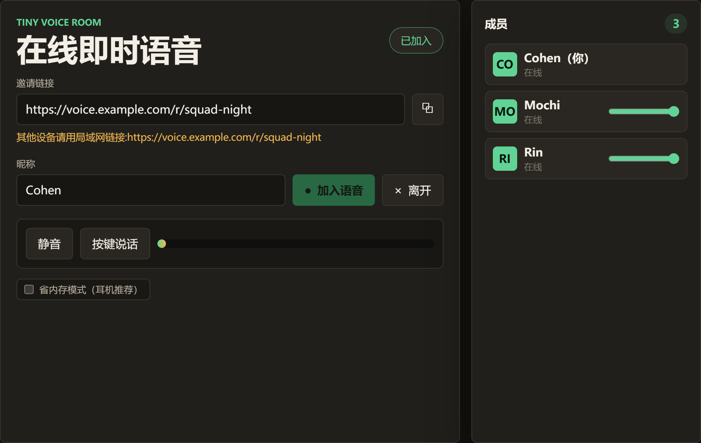
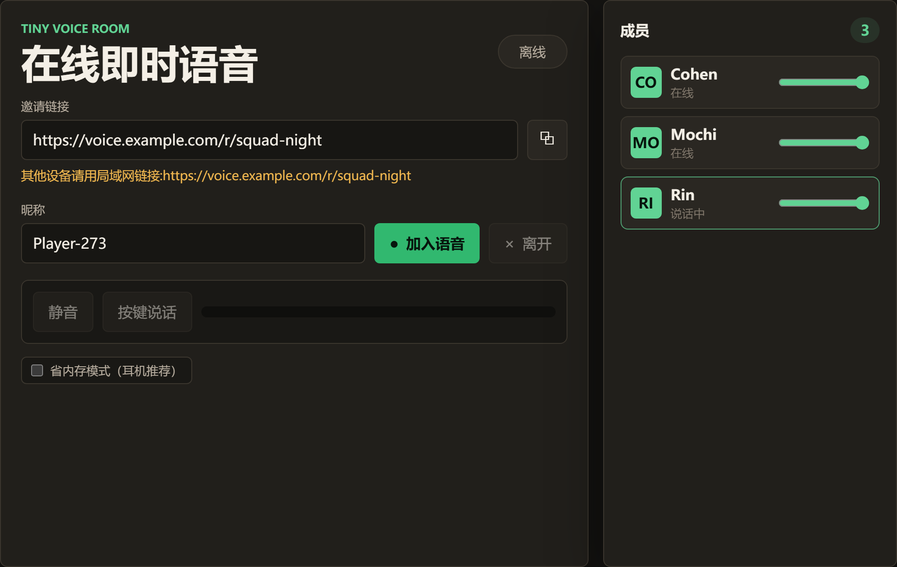
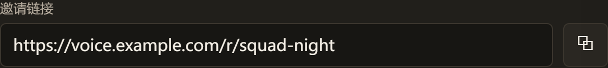
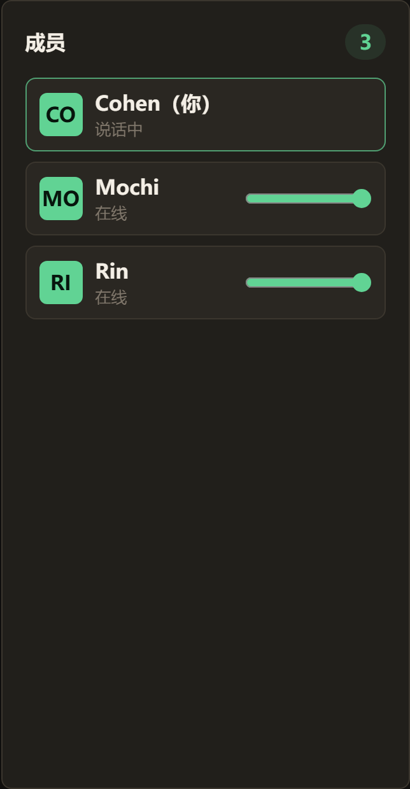
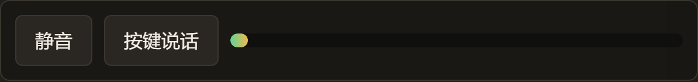

<div align="center">

# Tiny Voice Room

### 链接即房间，发出去就能开口说话。

无需账号、链接优先的 **WebRTC 语音房间**，专为开黑随手语音而生——发一条 URL，点对点直连说话，无注册、无数据库，全部装进**一个零依赖的 Node 文件**里。

[](https://github.com/Cohenjikan/tiny-voice-room/blob/main/LICENSE)
[](https://nodejs.org)
[](https://github.com/Cohenjikan/tiny-voice-room/blob/main/package.json)
[](#功能特性)
[](https://github.com/Cohenjikan/tiny-voice-room/blob/main/Dockerfile)
[](https://github.com/Cohenjikan/tiny-voice-room/stargazers)

[English](README.md) · **简体中文**



<sub> <a href="docs/assets/promo.mp4">观看 30 秒宣传片</a></sub>

</div>

> **和朋友开黑用的语音聊天——不用账号、不用安装、不用 Discord。**
> 音频在浏览器之间直连，小小的 Node 进程只负责中转信令，从不接触也不存储你的媒体流。房间只活在内存里，人走房消。

---

## 为什么用 Tiny Voice Room？

你和几个朋友想边玩边聊。开 Discord、让大家挨个登录、或者郑重其事地开个"会议"，都太重了。Tiny Voice Room 就是重型会议软件的反面：

- **链接即房间。** 发条链接就能说话。没有大厅、没有账号、不用装 App。
- **真正的点对点音频。** 服务端只转发信令——你的声音在浏览器之间直连，从不经过它。
- **零运行时依赖。** 没有 `node_modules`，没有供应链风险。一个能一口气读完的服务端文件。
- **没有数据库。** 房间是纯内存状态，空了就被回收。无需预置、无需备份。
- **刻意做减法。** 没有密码、踢人、录音、视频、文字聊天——这是设计。

---

## 快速开始

> 需要 **Node 20+**。没有任何东西需要 `npm install`——因为根本没有依赖。

```bash
git clone https://github.com/Cohenjikan/tiny-voice-room.git
cd tiny-voice-room
npm start
```

然后打开 **<http://localhost:4173>** ——它会把你带进一个全新的随机房间（`/r/<id>`）。把这条 URL 发出去就完事了。

想要一个有名字的房间？直接访问 **`http://localhost:4173/r/squad-night`** ——任何名字都行。

```bash
npm run check   # 可选：node --check 语法检查，无需依赖
```

> [!TIP]
> 在局域网里跨设备测试？应用会识别 loopback 地址，并在邀请框里自动换成本机的**局域网 IP**——把这条链接发出去，手机和其他电脑才连得上。

<div align="center">

</div>

---

## 功能特性

### 链接即房间
发条链接就能邀请——无注册、无大厅、不用装 App。访问 `/` 会悄悄把你送进一个全新的随机房间；想要指定房间就分享 `/r/<名字>`。房间号完全活在地址栏里。



### P2P mesh 音频——服务端从不接触媒体流
音频在浏览器之间通过一张 `RTCPeerConnection` 全连接网（mesh）直连。Node 进程只中转 SDP/ICE 信令，因此它**无法录音、无法窃听**，也因此很轻。（标准 WebRTC 的 DTLS-SRTP 会在传输中加密媒体——这不是额外的应用层端到端加密承诺，只是说你的声音从不经过服务端。）



### 每人独立音量、静音、按键说话
用每行的音量条单独平衡大嗓门和小声的朋友。一键静音，或者打开按键说话、**按住 `T`** 才出声。实时麦克风电平表让你知道自己到底有没有被听到。


### 为自部署而生
零运行时依赖，单个手写 WebSocket 的服务端文件。可配置的 STUN/TURN 应对真实网络，`/healthz` 健康检查端点，开箱即用的 `Dockerfile`，以及现成的 nginx / Caddy / systemd 配置。



| 特性 | 你得到什么 |
|---|---|
| **链接优先房间** | `/` → 随机房间，`/r/<名字>` → 指定房间，复制即邀请 |
| **P2P mesh 音频** | 浏览器直连；服务端仅做信令 |
| **零运行时依赖** | 单文件服务端，基于 `node:http` 手写 WS |
| **无数据库** | 内存房间，超过 `ROOM_TTL_MS`（默认 24h）后回收 |
| **每人音频控制** | 音量条、静音、按键说话（按住 `T`） |
| **STUN/TURN 配置** | 默认公共 STUN；可指向你自己的 TURN |
| **局域网感知邀请** | 自动局域网 IP 链接 + 进房前预览 |
| **容器/代理就绪** | Dockerfile、`/healthz`、HTTPS 反代示例 |

---

## 配置

全部通过环境变量配置——没有配置文件。

| 变量 | 默认 | 说明 |
|------|------|------|
| `HOST` | `0.0.0.0` | 监听地址 |
| `PORT` | `4173` | 监听端口 |
| `ROOM_TTL_MS` | `86400000` | 空房间多久后清理（毫秒） |
| `ICE_SERVERS` | 公共 STUN | STUN/TURN 列表 |

`ICE_SERVERS` 接受逗号分隔的 URL 列表，或一个 JSON 数组：

```json
[
  { "urls": ["stun:stun.l.google.com:19302"] },
  {
    "urls": ["turn:turn.example.com:3478"],
    "username": "user",
    "credential": "pass"
  }
]
```

---

## 部署

浏览器只在**安全上下文**（`localhost` 或 HTTPS）下才授予麦克风权限，所以任何对外部署**都必须走 HTTPS**——通常通过反向代理。

```
浏览器 ──HTTPS──▶ 反向代理 ──HTTP──▶ Node (127.0.0.1:4173)
```

<details>
<summary><b> Docker</b></summary>

```bash
docker build -t tiny-voice-room .
docker run --rm -p 4173:4173 tiny-voice-room
```

随仓库附带的镜像基于 `node:24-alpine`，`EXPOSE` 端口 `4173`。
</details>

<details>
<summary><b>nginx</b></summary>

```nginx
server {
    listen 80;
    server_name voice.example.com;
    return 301 https://$host$request_uri;
}

server {
    listen 443 ssl http2;
    server_name voice.example.com;
    ssl_certificate     /path/to/cert.pem;
    ssl_certificate_key /path/to/key.pem;

    location / {
        proxy_pass http://127.0.0.1:4173;
        proxy_http_version 1.1;
        proxy_set_header Host $host;
        proxy_set_header X-Real-IP $remote_addr;
        proxy_set_header X-Forwarded-For $proxy_add_x_forwarded_for;
        proxy_set_header X-Forwarded-Proto $scheme;
        proxy_set_header Upgrade $http_upgrade;
        proxy_set_header Connection "upgrade";
        proxy_read_timeout 3600s;
        proxy_buffering off;
    }
}
```
</details>

<details>
<summary><b>Caddy</b></summary>

```caddy
voice.example.com {
    reverse_proxy 127.0.0.1:4173
}
```

Caddy 默认转发 WebSocket，并自动签发 Let's Encrypt 证书。
</details>

<details>
<summary><b>systemd</b></summary>

```ini
[Unit]
Description=Tiny Voice Room
After=network.target

[Service]
Type=simple
User=ubuntu
WorkingDirectory=/opt/tinyvoice
Environment=HOST=127.0.0.1
Environment=PORT=4173
ExecStart=/usr/bin/node /opt/tinyvoice/server.mjs
Restart=on-failure
RestartSec=3

[Install]
WantedBy=multi-user.target
```
</details>

`GET /healthz` 返回 `{ "ok": true, "rooms": N, "clients": N }`，可用于存活检查。

---

## 老实说的限制

这是个小而专注的工具。看清它是什么，也别误会它不是什么：

- ** Mesh 拓扑。** 每多一个人，都给*每个*浏览器同时增加上行**和**下行带宽。建议房间人数 **≤ 6**。它不是"会议"软件。
- ** 离开 localhost 必须 HTTPS。** 麦克风需要安全上下文。任何对外部署都得走 HTTPS（例如经反向代理）。
- ** 严格 NAT 需要 TURN。** 没配 TURN 时，两端都在严格 NAT 后可能连不上。异地稳定通话请自部署 [coturn](https://github.com/coturn/coturn)。
- ** 房间是临时的。** 状态只在内存——重启服务会清空所有房间和成员。没有账号或个人资料；身份只是存在 `localStorage` 里、可随时改的昵称。
- ** 故意没有的功能。** 没有密码、踢人、录音、文字聊天、视频、屏幕共享。这些是设计上的取舍，不在路线图上。
- ** 界面语言。** 现版界面是**简体中文**（`lang="zh-CN"`）；本 README 是双语的，但应用内的文案目前还不是英文。
- ** JS 驱动的跳转。** 随机房间跳转发生在客户端（`history.replaceState`），不是服务端 HTTP 重定向——禁用 JavaScript 时，`/` 不会自动跳转。

---

## 项目结构

```
server.mjs        # 整个服务端：HTTP + 手写 WebSocket 信令，零依赖
public/
  index.html      # 房间界面
  app.js          # WebRTC mesh、控制、房间逻辑
  styles.css      # 样式
Dockerfile        # node:24-alpine，EXPOSE 4173
```

> [!NOTE]
> **服务端**是一个文件，但应用还附带一个 `public/` 目录。"一个零依赖的 Node 文件"指的是服务端。

---

## 参与贡献

欢迎 Issue 和 PR。代码刻意保持极小且零依赖——也请你这样维护它：`npm run check` 要能通过，且不引入任何运行时依赖。

## 许可证

[MIT](LICENSE) © Cohenjikan
